# Accounting System

A desktop accounting and business management application built with **C# Windows Forms** on **.NET Framework 4.7.2**. The system provides an integrated workflow for sales, purchases, invoicing, customers, inventory, payments, receipts, VAT, financial operations, and reporting.

> **Project type:** Desktop Accounting Application  
> **Platform:** Windows  
> **Architecture:** Windows Forms + SQL Server  
> **Target Framework:** .NET Framework 4.7.2

---

## 📸 Application Screenshots

The following screenshots showcase the main screens and workflows of the accounting system.


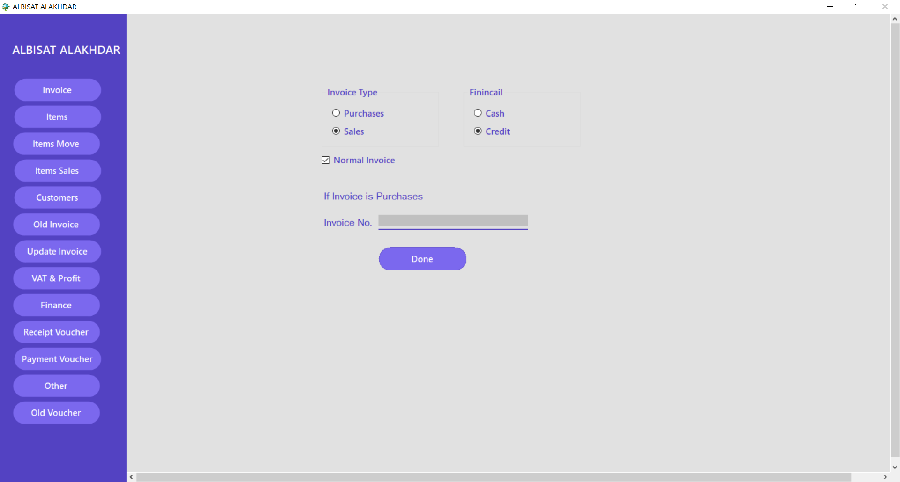

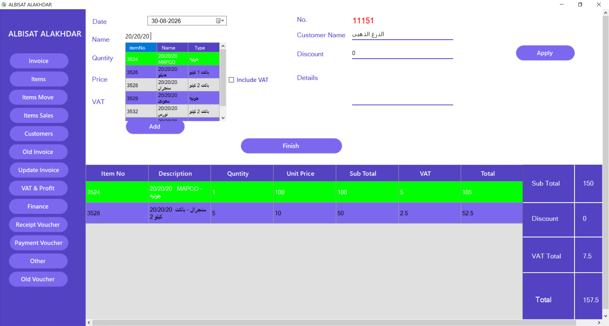

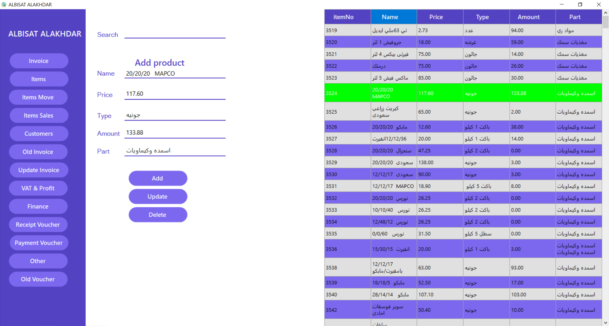

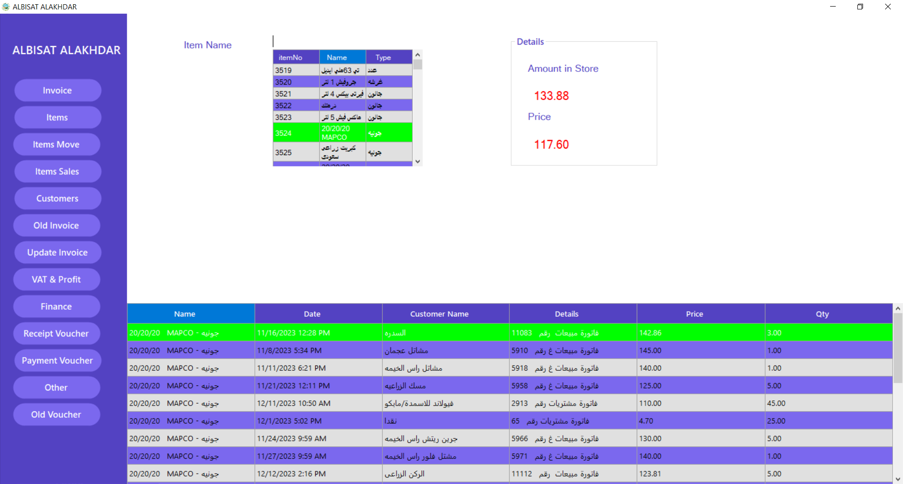

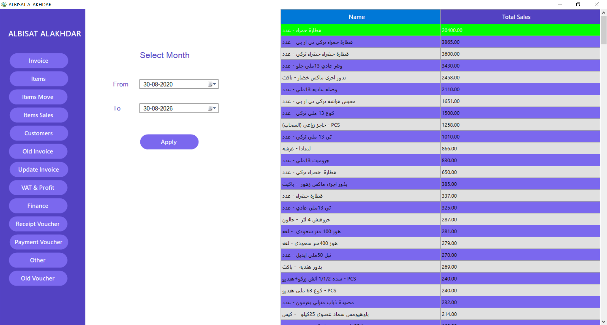

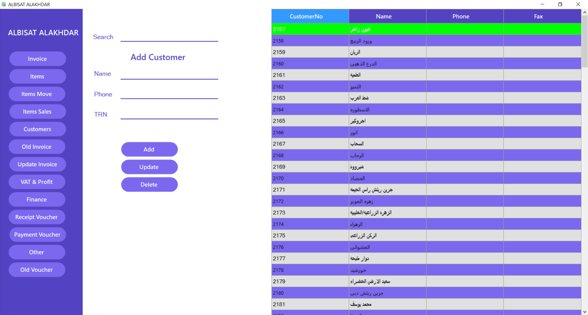

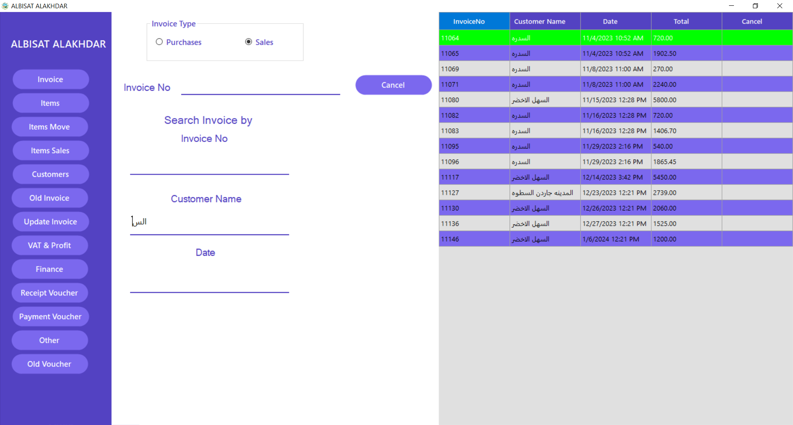

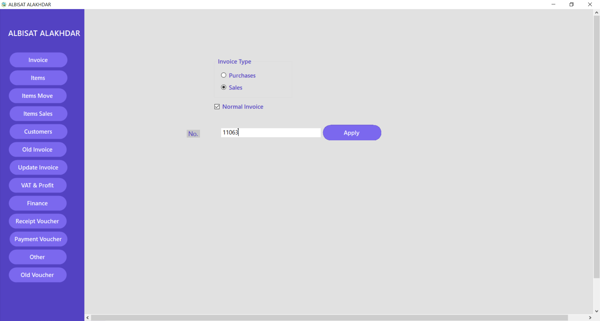

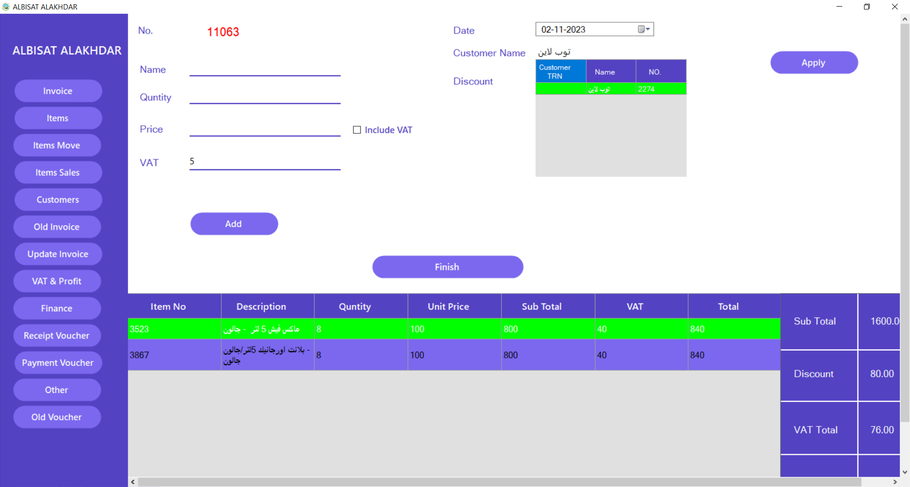

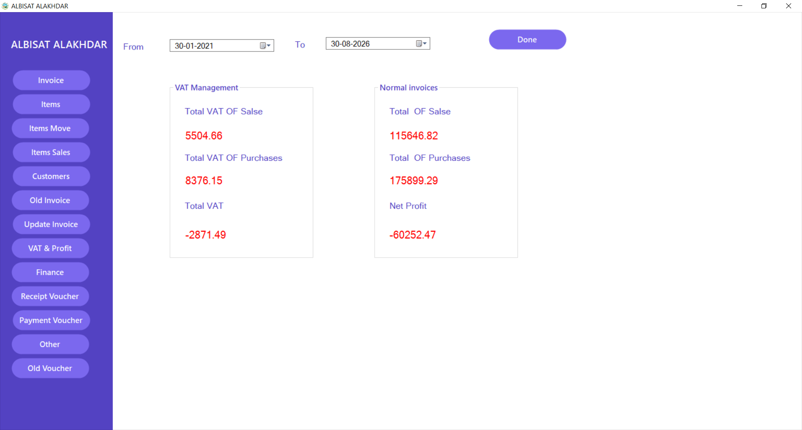

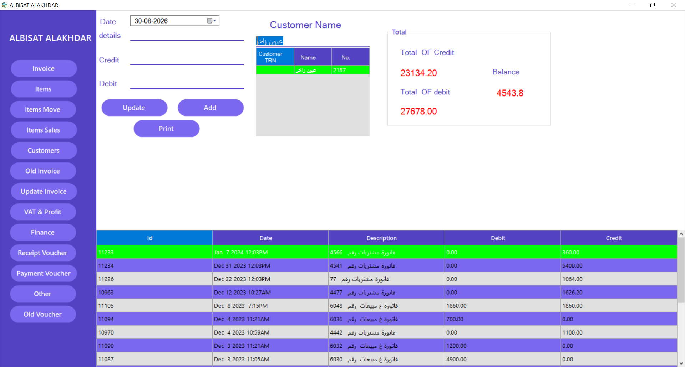

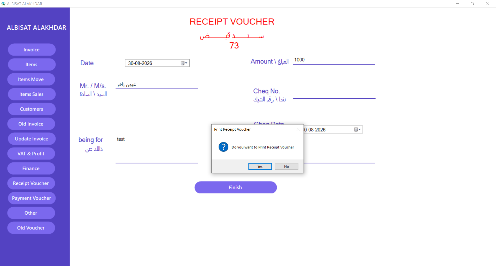

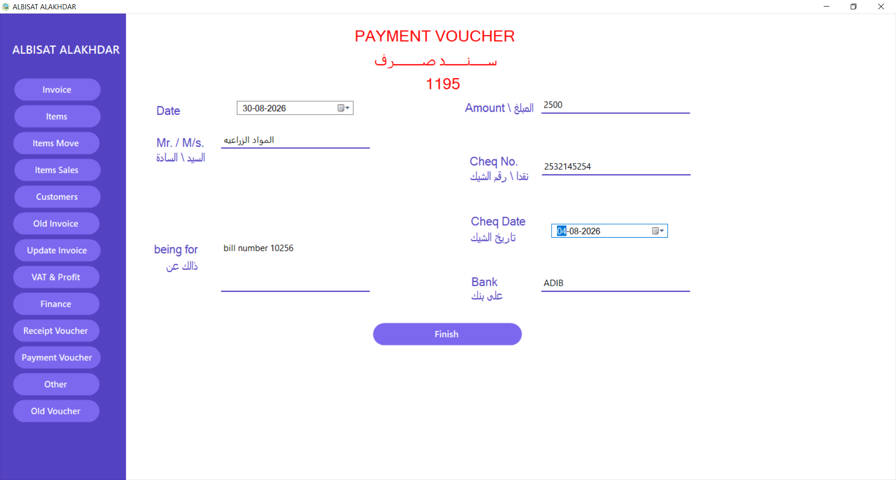

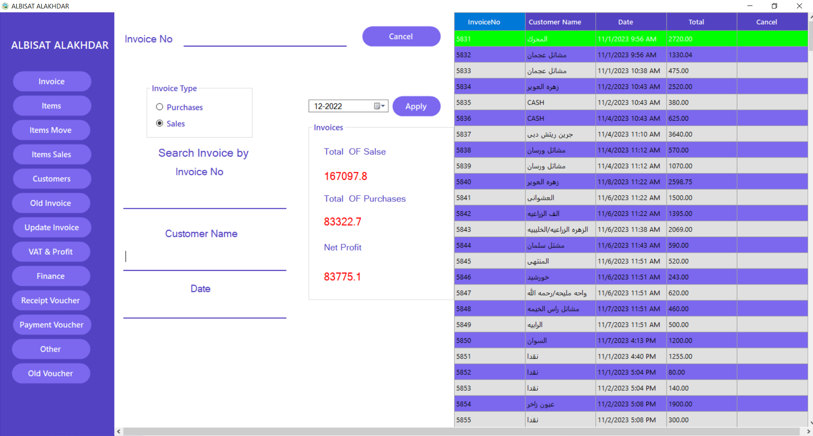

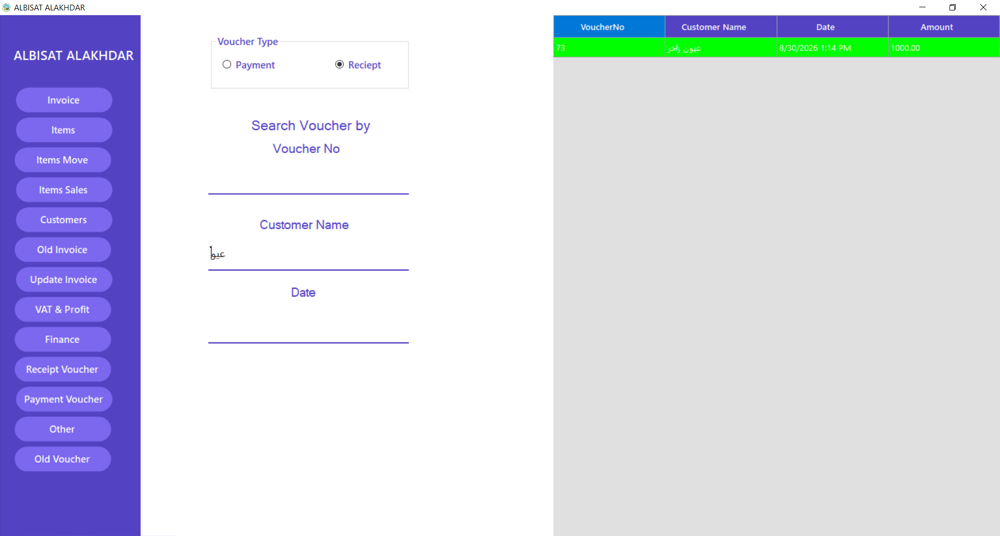

---

## ✨ Features

### Sales & Invoicing

- Create and manage sales invoices.
- Support purchase invoices.
- Add multiple items to an invoice.
- Search customers and products while creating invoices.
- Apply discounts and VAT calculations.
- Calculate invoice totals with decimal precision.
- Convert invoice totals to Arabic words.
- Review previously created invoices.

### Customers

- Manage customer records.
- Search customers from the invoicing workflow.
- Use customer information directly within sales and purchase operations.

### Products & Inventory

- Product management.
- Product search and selection during invoicing.
- Track item movement.
- Manage sales-related item operations.
- Update inventory information.

### Financial Operations

- Financial management screens.
- Payment vouchers.
- Receipt vouchers.
- Additional financial operations.
- Financial transaction workflows connected to the database.

### VAT

- VAT-aware invoice calculations.
- VAT management workflow.
- Support for the UAE VAT rate used by the application.

### Reporting

- Crystal Reports integration.
- Payment reports.
- Receipt reports.
- Printable/report-oriented accounting workflows.

### User Interface

- Windows Forms desktop interface.
- Bunifu UI components for modern controls and visual elements.
- Embedded form navigation through a shared main application shell.
- DataGridView-based data presentation and search workflows.

---

## 🧭 Main Modules

The application currently exposes the following major modules from the main application shell:

| Module | Purpose |
|---|---|
| Invoices | Sales and purchase invoice management |
| Products | Product and item management |
| Customers | Customer management |
| Financial | Financial operations and records |
| VAT | VAT-related operations |
| Item Sales | Sales-oriented item operations |
| Payments | Payment voucher management |
| Receipts | Receipt voucher management |
| Other Operations | Additional accounting operations |
| Inventory Update | Inventory adjustments and updates |
| Item Movement | Item movement tracking |
| Previous Invoices | Review existing invoices |
| Previous Vouchers | Review existing vouchers |

---

## 🏗️ Application Architecture

The application follows a desktop-oriented structure where the main form acts as the application shell and loads feature forms inside the central content panel.

```text
Accounting System
│
├── Main Application Shell
│   └── Form1
│
├── Authentication
│   └── Login
│
├── Sales & Purchasing
│   ├── InvoiceForm
│   ├── OldInvoiceForm
│   └── OldVoucherForm
│
├── Customers
│   └── CustomersForm
│
├── Products & Inventory
│   ├── ProductsForm
│   ├── ItemsSalesForm
│   ├── ItemMoveForm
│   └── UpdateInvForm
│
├── Financial Operations
│   ├── FinancialForm
│   ├── PaymentVForm
│   ├── ReceiptVForm
│   └── OtherForm
│
├── VAT
│   └── VATForm
│
├── Database Layer
│   ├── ConnectDB
│   └── DBquery
│
└── Reporting
    └── Crystal Reports
```

The main shell dynamically loads feature forms into the central application panel, keeping the user inside a single desktop workspace instead of opening a separate top-level window for every module.

---

## 🛠️ Technology Stack

| Technology | Usage |
|---|---|
| **C#** | Application development |
| **Windows Forms** | Desktop UI |
| **.NET Framework 4.7.2** | Application runtime/framework |
| **Microsoft SQL Server / SQL Server Express** | Database |
| **ADO.NET / SqlClient** | Database connectivity |
| **Bunifu UI WinForms** | UI controls and styling |
| **Crystal Reports** | Reporting and printable documents |
| **NumberToWord** | Converting invoice totals to words |
| **log4net** | Logging support |

---

## 🔄 Typical Invoice Workflow

```text
Login
  ↓
Main Application
  ↓
Create Invoice
  ↓
Search Customer
  ↓
Search / Select Product
  ↓
Add Invoice Items
  ↓
Calculate Subtotal
  ↓
Apply Discount / VAT
  ↓
Calculate Final Total
  ↓
Convert Total to Words
  ↓
Save Invoice
  ↓
Generate / View Report
```

The invoice workflow includes customer and item search, invoice item selection, discount handling, VAT calculations, total calculation, and conversion of the final amount into Arabic words.

---

## 🗄️ Database

The application uses **Microsoft SQL Server / SQL Server Express** through `System.Data.SqlClient`.

The current database connection is configured for a local SQL Server Express instance using the database name:

```text
ShopDB
```

Current connection configuration:

```text
Data Source=.\\SQLEXPRESS
Initial Catalog=ShopDB
Integrated Security=True
MultipleActiveResultSets=true
```

> **Important:** A database backup/schema is not currently included in this repository. Before running the application on another machine, make sure the required `ShopDB` database and its tables are available and update the connection string if your SQL Server instance is different.

---

## 🚀 Getting Started

### Prerequisites

- Windows 10 or Windows 11
- Visual Studio with .NET Framework 4.7.2 development support
- SQL Server Express or Microsoft SQL Server
- Crystal Reports runtime/designer components compatible with the project
- Required NuGet/package dependencies restored by Visual Studio

### Installation

1. Clone the repository:

```bash
git clone https://github.com/Amrnaassar/Accounting-System.git
```

2. Open the solution/project in Visual Studio.
3. Restore the project dependencies/packages.
4. Make sure SQL Server Express is installed and the required `ShopDB` database is available.
5. If necessary, update the database connection in `ConnectDB.cs`.
6. Build the project.
7. Run the application from Visual Studio.

---

## 🔐 Configuration Notes

The application currently uses Windows integrated authentication for SQL Server. For a different SQL Server instance, update the connection string rather than hard-coding machine-specific server names elsewhere in the application.

For production or distributed environments, database configuration should ideally be moved to an external configuration mechanism instead of keeping environment-specific connection details directly in source code.

---

## 📊 Reporting

The project integrates **Crystal Reports** for report generation, including payment and receipt report definitions.

This allows accounting operations to be presented in printable/report-oriented formats from the desktop application.

---

## 📁 Repository Highlights

```text
Accounting-System/
│
├── AccountingApp.csproj
├── App.config
├── ConnectDB.cs
├── DBquery.cs
├── Form1.cs
├── Login.cs
├── InvoiceForm.cs
├── CustomersForm.cs
├── FinancialForm.cs
├── ProductsForm.cs
├── ItemsSalesForm.cs
├── ItemMoveForm.cs
├── UpdateInvForm.cs
├── PaymentVForm.cs
├── ReceiptVForm.cs
├── VATForm.cs
├── OtherForm.cs
│
├── *.Designer.cs
├── *.resx
├── *.rpt
│
└── docs/
    └── screenshots/
        ├── 1.png
        ├── 2.png
        ├── ...
        └── 16.png
```

---

## 🎯 Project Goals

The project was developed to provide a practical desktop accounting workflow that brings core business operations into one application:

- Reduce manual accounting operations.
- Centralize customer, product, sales, purchasing, and financial data.
- Improve invoice creation and calculation workflows.
- Provide reusable reporting capabilities.
- Maintain a structured desktop workflow for day-to-day business operations.

---

## 🔮 Potential Improvements

Possible future improvements include:

- Externalized database configuration.
- Database schema/backup included in the repository.
- Improved separation between UI, business logic, and data access.
- Stronger validation and centralized error handling.
- Automated testing for accounting calculations.
- Role-based access control and audit logging.
- Migration to a more modern application architecture/API when required.
- Automated build and release pipeline.

---

## 👨‍💻 Author

**Omar Fathi**  
Full-Stack Software Engineer

GitHub: [@Amrnaassar](https://github.com/Amrnaassar)

---

## 📄 License

No explicit open-source license is currently included in the repository. Unless a license is added, the source code should be treated as **all rights reserved**.

---

## ⭐ Project Note

This repository demonstrates a complete desktop accounting application built around real business workflows, database-backed financial operations, invoice processing, inventory management, and reporting.
